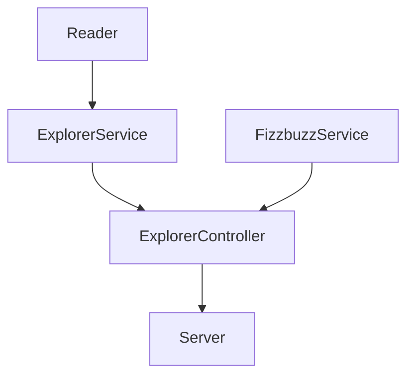

# Como se inicio este proyecto

## Parte1 

1.- Ejecutamos `npm init -y`

2.- Ejecutamos `npm install --save-dev jest`

3.- Correr las pruebas npm test

4.- Instalamos lint `npm install eslint --save-dev`

5.- Ejecuta el comando para generar la configuración del linter:
npm init @eslint/config

`Es indispensable revisar la documentación de cada dependencia que usemos: https://eslint.org/docs/rules/`

6.- Configuramos las rules del archivo de linter y la seccion de script del package.json

7.- Corremos los siguientes comandos que se personalizaron anteriormente
- `npm run linter` 
- `npm run linter-fix`

Basado en las instrucciones de la siguiente URL de programa de capacitacion por LaunchX

**[refactoring](https://github.com/LaunchX-InnovaccionVirtual/MissionNodeJS/blob/main/semanas/semana_4/1_refactoring_fizzbuzz_parte1.md)**

## Parte2 
La separación de clases y directorios nos ayuda a tener una estructura pero también una separación de responsabilidades.

- Services: clases para aplicar lógica que necesitemos usando modelos.
- Utils: clases auxiliares.
- Controllers: Uso de exclusivo de services.

Objetivo 

1.- Instalamos npm install express --save

2.- Creamos el archivo server para acceder a los controladores mediante los endpoint que tendra

3- Corremos el servidor con el siguiente comando node lib/server.js

4.- Accedemos a nuestro endpoint http://localhost:3000/

4.- Accedemos a nuestro endpoint http://localhost:3000/v1/explorers/node

5.- Automatiza tu package.json para automatizar tu server, agrega la siguiente línea dentro de scripts: "server": "node ./lib/server.js". Después solo tendrás que usar npm run server para iniciar tu servidor.

6.- Ejecutamos el comando npm run server

Basado en las instrucciones de la siguiente URL de programa de capacitacion por LaunchX

**[Refactoring Parte 2](https://github.com/LaunchX-InnovaccionVirtual/MissionNodeJS/blob/main/semanas/semana_4/2_api_fizzbuzz_parte2.md)**

Herramientas

