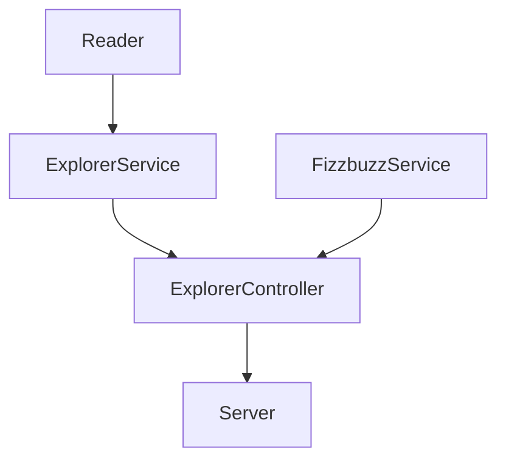
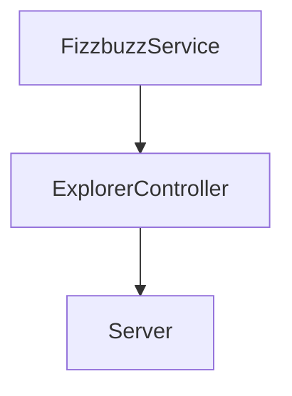

# Como se inicio este proyecto

## Parte1 

1.- Ejecutamos `npm init -y`

2.- Ejecutamos `npm install --save-dev jest`

3.- Correr las pruebas npm test

4.- Instalamos lint `npm install eslint --save-dev`

5.- Ejecuta el comando para generar la configuración del linter:
npm init @eslint/config

`Es indispensable revisar la documentación de cada dependencia que usemos: https://eslint.org/docs/rules/`

6.- Configuramos las rules del archivo de linter y la seccion de script del package.json

7.- Corremos los siguientes comandos que se personalizaron anteriormente
- `npm run linter` 
- `npm run linter-fix`

Basado en las instrucciones de la siguiente URL de programa de capacitacion por LaunchX

**[refactoring](https://github.com/LaunchX-InnovaccionVirtual/MissionNodeJS/blob/main/semanas/semana_4/1_refactoring_fizzbuzz_parte1.md)**

## Parte2 
La separación de clases y directorios nos ayuda a tener una estructura pero también una separación de responsabilidades.

- Services: clases para aplicar lógica que necesitemos usando modelos.
- Utils: clases auxiliares.
- Controllers: Uso de exclusivo de services.

Objetivo 


1.- Instalamos npm install express --save

2.- Creamos el archivo server para acceder a los controladores mediante los endpoint que tendra

3- Corremos el servidor con el siguiente comando node lib/server.js

4.- Accedemos a nuestro endpoint http://localhost:3000/

4.- Accedemos a nuestro endpoint http://localhost:3000/v1/explorers/node

5.- Automatiza tu package.json para automatizar tu server, agrega la siguiente línea dentro de scripts: "server": "node ./lib/server.js". Después solo tendrás que usar npm run server para iniciar tu servidor.

6.- Ejecutamos el comando npm run server

Basado en las instrucciones de la siguiente URL de programa de capacitacion por LaunchX

**[Refactoring Parte 2](https://github.com/LaunchX-InnovaccionVirtual/MissionNodeJS/blob/main/semanas/semana_4/2_api_fizzbuzz_parte2.md)**

## Parte 3

Ahora que tenemos ya lo que queríamos, es decir, ya refactorizamos nuestro script legado y ya creamos un API para exponer esa funcionalidad al mundo de nuestros clientes. 

Tenemos un nuevo cliente que necesita parte de lo que ya tenemos pero de diferente forma. Es decir, el enviará un score, y nosotros le daremos lo correspondiente al trick. Esa validación es la que ya tenemos en FizzbuzzService. Pero ahora no necesitamos agregarle un campo a ningún explorer, solo regresar la palabra 'Fizz', 'Buzz', 'Fizzbuzz' o el score mismo, según es el caso. Cobraremos por cada request que recibamos.

Nuevo requerimiento: Crea un endpoint para recibir un número y aplicar la validación del fizzbuzz. (ESTO SE DEBE CREAR DESDE CERO)

| Endpoint | Request | Response |
|---|---|---|
| `localhost:3000/v1/fizzbuzz/:score` | `localhost:3000/v1/fizzbuzz/1` | `{score: 1, trick: 1}` |
| `localhost:3000/v1/fizzbuzz/:score` | `localhost:3000/v1/fizzbuzz/3` | `{score: 3, trick: "Fizzz"}` |
| `localhost:3000/v1/fizzbuzz/:score` | `localhost:3000/v1/fizzbuzz/5` | `{score: 5, trick: "Buzz"}` |
| `localhost:3000/v1/fizzbuzz/:score` | `localhost:3000/v1/fizzbuzz/15` | `{score: 15, trick: "Fizzbuzz"}` |

# Diseño actual


# Flujo de Nueva funcionalidad



De entrada el único punto de conexión que debe haber entre nuestra funcionalidad y el server será el `ExplorerController`. Así vamos a mantener una organización y separación de responsabilidades adecuado. 

Se creará la nueva funcionalidad dentro de `FizzbuzzService`, misma que será usada en el `ExplorerController` y de ahí podrá ser implementada en el server.

1. Crea un nuevo método `static applyValidationInNumber(number){` en `FizzbuzzService`.
  - Implementa la validación de fizzbuzz, solo regresa el valor: "Fizz", "Buzz", "Fizzbuzz" o el mismo número recibido.

2. Crea un nuevo método en `ExplorerController` que reciba un número y use la función del `FizzbuzzService` que acabas de crear.
3. Finalmente usa este método dentro de un nuevo endpoint en el server. Aquí te dejo un ejemplo de cómo se debería ver tu nuevo endpoint:


**[Reafactoring Parte 3](https://github.com/LaunchX-InnovaccionVirtual/MissionNodeJS/blob/main/semanas/semana_4/3_nuevo_feature_fizzbuzz_parte3.md)**

## Parte 4 Contribuccion a OpenSource a Visualpartnership

**[Refactoring Parte 4](https://github.com/LaunchX-InnovaccionVirtual/MissionNodeJS/blob/main/semanas/semana_4/4_contribution.md)**

## **Conclusiones. Apuntes propios**

1. Por cada metodo dentro del archivo del **controlador** tiene su propio metodo dentro del archivo de **service**.
**Ojo**. Y dentro del metodo de service no accede a datos del modelo, si no que cuando se manda a llamar el metodo del controlador se sacan los datos primero del modelo y esos datos se pasan al service para que el servicio haga su trabajo correspondiente.

1. Por cada metodo de **endpoint** dentro del archivo de server tiene su propio metodo dentro del archivo de **controlador**.

1. Las responsabilidades dentro del **endpoint** solo es sacar los datos que recibimos de la fuente externa(Navegador) de quien lo invoca para que se invoque internamente el controlador y esa respuesta se la mandemos a quien invoco el endpoint.

1. Las responsabilidades dentro del **controlador** son:
    - Sacar los datos del modelo
    - Procesar esos datos y devolver el resultado a traves de un metodo el archivo de service
    - retornar el resultado esperado al endpoint

NOTA. 
- El **Servicio** no accede a datos del modelo, solo tiene la logica para que a partir de unos datos que se le pasan pueda hacer su trabajo.

- El **modelo** solo saca datos.

## Parte 5: Crea un nuevo bot de telegram

1. Descarga y crea una cuenta de telegram.
2. Accede al Bot Father: https://telegram.me/BotFather
3. En el chat del bot father envía un mensaje con el texto: `/newbot`
4. Te pedirá un nombre para tu bot, nombralo: `FizzbuzzLaunchXBot`
5. Guarda el token de tu nuevo bot, esta es información sensible `5112341234:AAFB-c7Jau2TNt0-s6ioQGOAiUtqcsdewdwedwo`.
6. Así mismo te dará una url para que abras un nuevo chat con tu bot, enseguida presiona el botón de START, necesitas realizar este paso.


# Parte 6: Fizzbuzz

1. Abre tu proyecto de fizzbuzz 
2. Instala la dependencia: `npm install node-telegram-bot-api --save`
3. Crea un nuevo script llamado `lib/bot.js`
4. Modifica tu `package.json`, dentro de scripts agrega: `"bot": "node ./lib/bot.js"`
5. En tu archivo `bot.js` agrega el siguiente contenido:

```javascript
const TelegramBot = require("node-telegram-bot-api");
const ExplorerController = require("./controllers/ExplorerController");

// replace the value below with the Telegram token you receive from @BotFather
const token = "";

// Create a bot that uses 'polling' to fetch new updates
const bot = new TelegramBot(token, {polling: true});

// Matches "/echo [whatever]"
bot.onText(/\/echo (.+)/, (msg, match) => {
    // 'msg' is the received Message from Telegram
    // 'match' is the result of executing the regexp above on the text content
    // of the message

    const chatId = msg.chat.id;
    const resp = match[1]; // the captured "whatever"

    // send back the matched "whatever" to the chat
    bot.sendMessage(chatId, resp);
});

// Listen for any kind of message. There are different kinds of
// messages.
bot.on("message", (msg) => {
    const chatId = msg.chat.id;
    const numberToApplyFb = parseInt(msg.text);

    if(!isNaN(numberToApplyFb)){
        const fizzbuzzTrick = ExplorerController.applyFizzbuzz(numberToApplyFb);
        const responseBot = `Tu número es: ${numberToApplyFb}. Validación: ${fizzbuzzTrick}`;
        bot.sendMessage(chatId, responseBot);
    } else {
        bot.sendMessage(chatId, "Envía un número válido");
    }

});
```

Verifica:
- Aquí agrega el token que te dió el Bot Father: `const token = "";`
- Verifica que este bien la ruta de tu ExplorerController
- Lee y entiende qué se realiza en la última función.
- Recuerda no versionar tu token.

6. Corre tu nuevo bot: `npm run bot`
7. Ve a tu chat con el nuevo bot y cada que envíes un número deberá darte la validación del fizzbuzz. Cualquier otro valor te madnará un mensaje de error.


8. Refactoriza el snippet de código anterior y envíalo al ExplorerController.
9. Valida que al enviar la palabra "node" o "java", regreses al bot la lista de nombres de los explorers de esa misión. Recuerda que el bot solo puede recibir un string, tendrás que armar ese string con los nombres. No olvides agregar una prueba para generar ese string. No es necesario que hagas pruebas de la funcionalidad del bot.

3.- En caso de no tener la carpeta .env, al ejecutar `node app.js` mandara el siguiente error

**por eso para ejecutar este proyecto hay que crear este archivo con el Key y Token correspondiente de Trello**
- El archivo .env debe tener la escructura 

```
TOKEN_BOT_TELEGRAM="your token"
```

10. Refactorizar el codigo de Telegram en el controlador ExplorerControllers y correr la aplicacion con `node app.js`


